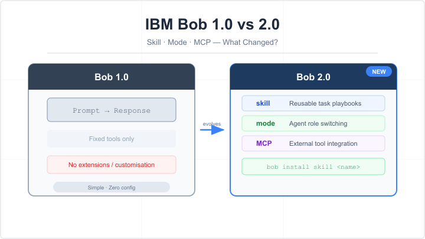
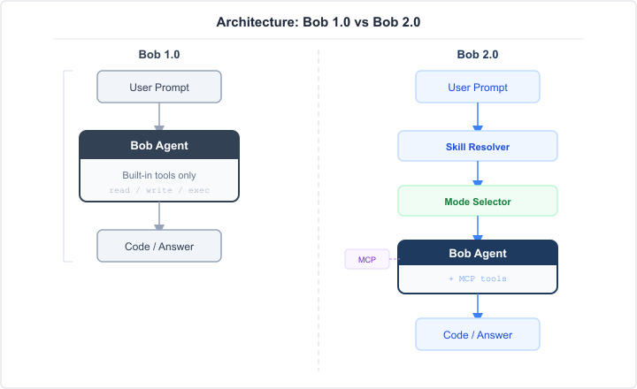
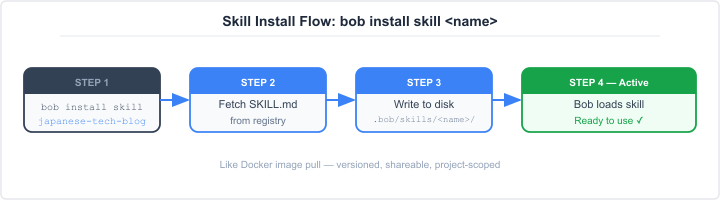

# IBM Bob 1.0 vs 2.0 入門：skill・mode・MCP で何が変わったか

> この記事は `japanese-tech-blog` スキルで生成した Qiita 向けサンプル記事です。


*IBM Bob のバージョン進化：シンプルなエージェントから拡張可能なプラットフォームへ*

---

## はじめに

この記事では、AI コーディングアシスタント **IBM Bob** のバージョン 1.0 と 2.0 の違いを、
初めて Bob を使う方向けにわかりやすく解説します。

**対象読者：**

- IBM Bob を使い始めたばかりの方
- Bob 1.0 から 2.0 へアップデートを検討している方
- AI コーディングエージェントの仕組みに興味がある方（プログラミング経験は不要）

**この記事でわかること：**

- Bob 1.0 と 2.0 の設計思想の違い
- 2.0 で追加された主な機能（skill・mode・MCP サポート）
- **image（スキルインストール）** の仕組みとは何か
- どちらのバージョンを選ぶべきか

---

## 背景 — なぜ Bob は 2.0 になったのか

Bob 1.0 は「チャットで指示を送ると AI がコードを書いてくれる」シンプルなエージェントでした。
しかし、プロジェクトが大規模化するにつれ、次のような課題が出てきました。

- 毎回同じ指示をプロンプトに書くのが手間
- チームごとにエージェントの動作を調整できない
- 外部ツール（API・データベース等）との連携が難しい

Bob 2.0 はこれらをすべて解決するために設計し直されたバージョンです。

---

## Bob 1.0 の特徴

Bob 1.0 の動作モデルはシンプルです。

```text
ユーザー → プロンプト入力 → Bob → コード / 回答の出力
```

| 特徴 | 詳細 |
|---|---|
| **単一モード** | 常に「コードエージェント」として動作 |
| **設定なし** | `.claude` や `.bob` などの設定ディレクトリが不要 |
| **ツールは固定** | ファイル読み書き・コマンド実行など基本ツールのみ |
| **拡張性なし** | スキルや外部 MCP サーバーを追加できない |

シンプルで始めやすい反面、「AI の動作をカスタマイズしたい」
「チーム全員で同じ設定を共有したい」といったニーズには応えられませんでした。

---

## Bob 2.0 の特徴

Bob 2.0 では、エージェントの動作を **skill（スキル）** と **mode（モード）** という 2 つの仕組みで
柔軟にカスタマイズできるようになりました。また、**MCP（Model Context Protocol）** を介して
外部ツールとシームレスに連携できます。


*図1：Bob 1.0（左）はシンプルな 1 層構造。Bob 2.0（右）は skill・mode・MCP の 3 層で構成される。*

### skill（スキル）とは

スキルとは、「Bob がある特定のタスクをこなすための専門知識・手順書」です。
Markdown ファイル（`SKILL.md`）としてプロジェクトに追加します。

```text
.bob/
└── skills/
    └── japanese-tech-blog/
        └── SKILL.md   ← このファイルがスキル本体
```

Bob はユーザーの指示を受けたとき、登録されているスキルの中から最も適切なものを自動で選び、
その手順書に従って動作します。

**スキルの例：**

- `japanese-tech-blog` — 日本語技術記事を書くための文体・構成ガイド
- `configure-mcp` — MCP サーバーの設定手順
- `ios-qa` — iOS アプリの QA テスト手順

スキルは **インストール可能** です。公式リポジトリや独自のスキルをプロジェクトに追加できます。

### mode（モード）とは

モードとは、「Bob の役割・人格・使えるツールのセット」を定義したものです。

```yaml
# custom_modes.yaml の例
modes:
  - id: plan
    name: Plan
    roleDefinition: >
      You are a senior architect. Think before acting.
      Do not write code; produce specifications only.
```

| モード | 用途 |
|---|---|
| **agent**（デフォルト）| コードの実装・修正 |
| **plan** | 設計・仕様策定（コードは書かない） |
| **ask** | 説明・ドキュメント参照のみ |
| カスタムモード | チーム独自の役割を定義 |

### MCP（Model Context Protocol）サポート

MCP は外部ツールを Bob に接続するための標準プロトコルです。
Bob 2.0 では MCP サーバーを設定するだけで、データベースや社内 API など
任意のツールを Bob から使えるようになります。

```json
// .bob/mcp.json の例
{
  "servers": {
    "my-db-tool": {
      "command": "npx",
      "args": ["my-db-mcp-server"]
    }
  }
}
```

---

## image（スキルインストール）とは何か

:::note
「image」は Bob 2.0 のスキルインストール機能の通称です。
Docker の「image を pull する」感覚でスキルをインストールできることから、この名前が使われています。
:::

Bob 2.0 では、スキルのインストールは以下のコマンドで行います。

```bash
# Bob のスキルインストールコマンド例
bob install skill japanese-tech-blog
```

上記を実行すると、次のようなファイルが自動生成されます。

```text
.bob/
└── skills/
    └── japanese-tech-blog/
        └── SKILL.md
```

Docker のイメージと同様に、スキルは **バージョン管理** でき、
チームで共有したり、プロジェクトごとに異なるスキルセットを管理したりすることができます。


*図2：`bob install skill` コマンドを実行すると、スキルが取得され `.bob/skills/` に配置され、Bob が自動で読み込む。*

---

## Bob 1.0 vs 2.0 — 機能比較

| 機能 | Bob 1.0 | Bob 2.0 |
|---|---|---|
| 基本的なコード生成 | ✓ | ✓ |
| モードの切り替え | ✗ | ✓ |
| スキルの追加 | ✗ | ✓ |
| MCP サーバー連携 | ✗ | ✓ |
| チーム設定の共有 | ✗ | ✓（設定ファイルで管理） |
| カスタムモード定義 | ✗ | ✓ |
| スキルのバージョン管理 | ✗ | ✓ |

---

## どちらを選ぶべきか

**Bob 1.0 が向いているケース：**

- 個人プロジェクトで、シンプルにコードを書いてほしいだけ
- カスタマイズの必要性を感じていない

**Bob 2.0 が向いているケース：**

- チームで AI エージェントの動作を統一したい
- 特定のタスク（ブログ執筆・コードレビュー・QA など）を繰り返し行う
- 外部ツールと連携させたい
- プロジェクトごとにエージェントの動作を変えたい

:::note
新規プロジェクトであれば、迷わず **Bob 2.0** を選ぶことをおすすめします。
1.0 に比べて設定ファイルが増えますが、一度整えれば長期的に生産性が上がります。
:::

---

## まとめ

Bob 1.0 はシンプルなプロンプト→応答型のエージェントでしたが、Bob 2.0 は
**skill・mode・MCP** の 3 つの柱によって大幅に拡張性が向上しました。

- **skill** で「どうやってタスクをこなすか」を教え込める
- **mode** で「どの役割として動くか」を切り替えられる
- **MCP** で外部ツールをシームレスに接続できる
- **image（スキルインストール）** は Docker のイメージと同様の感覚でスキルを管理する仕組み

まずは公式スキルをいくつかインストールして、Bob 2.0 の動作の変化を体感してみてください。

---

## 参考リンク

- [IBM Bob 公式ドキュメント](https://www.ibm.com/bob)
- [MCP（Model Context Protocol）仕様](https://modelcontextprotocol.io)
- [Bob スキルリポジトリ](https://github.com/ibm/bob-skills)
