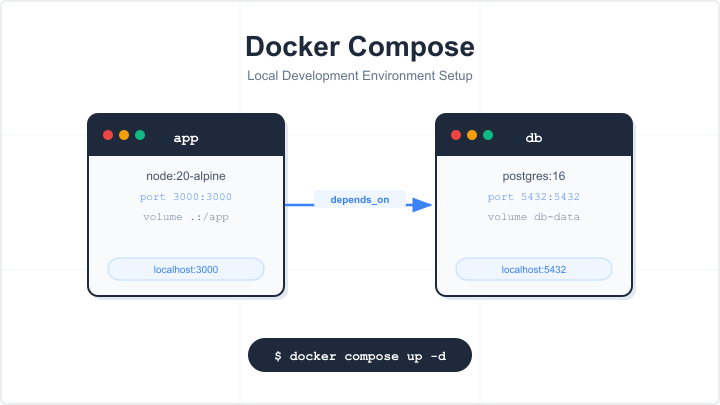
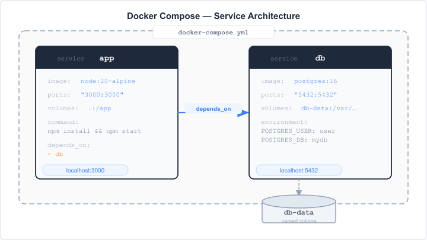

# サンプル記事：Docker Compose で開発環境を 5 分で構築する方法

> このファイルは `japanese-tech-blog` スキルが生成する記事スタイルのサンプルです。


*Docker Compose で app コンテナと db コンテナを一発起動する*

---

## はじめに

この記事では、Docker Compose を使ってローカル開発環境を素早く構築する手順を解説します。

**対象読者：**
- Docker の基本的な概念（コンテナ・イメージ）がわかる方
- `docker run` を使ったことがある方

**この記事を読むとわかること：**
- `docker-compose.yml` の基本的な書き方
- Web アプリ + データベースの構成例
- よく使うコマンドの一覧

## 環境・前提条件

| 項目 | バージョン |
|---|---|
| Docker Desktop | 4.x 以上 |
| OS | macOS / Linux / Windows (WSL2) |

## Docker Compose とは

Docker Compose は、複数のコンテナをまとめて定義・起動するためのツールです。
`docker-compose.yml` という設定ファイルに各サービスの構成を書くことで、
コマンド一つで環境全体を立ち上げられます。


*図1：docker-compose.yml で定義した app（Node.js）と db（PostgreSQL）の構成。volumes でデータを永続化し、depends_on で起動順を制御する。*

## 手順

### 1. プロジェクトディレクトリを作成する

```bash
mkdir my-app && cd my-app
```

### 2. `docker-compose.yml` を作成する

以下の内容で `docker-compose.yml` を作成します。
Node.js の Web アプリと PostgreSQL データベースを組み合わせた構成例です。

```yaml:docker-compose.yml
version: "3.9"

services:
  app:
    image: node:20-alpine
    working_dir: /app
    volumes:
      - .:/app
    ports:
      - "3000:3000"
    command: sh -c "npm install && npm start"
    depends_on:
      - db

  db:
    image: postgres:16
    environment:
      POSTGRES_USER: user
      POSTGRES_PASSWORD: password
      POSTGRES_DB: mydb
    volumes:
      - db-data:/var/lib/postgresql/data
    ports:
      - "5432:5432"

volumes:
  db-data:
```

### 3. 環境を起動する

以下のコマンドでバックグラウンドで起動します。

```bash
docker compose up -d
```

起動後、ログを確認するには次のコマンドを使います。

```bash
docker compose logs -f
```

## 動作確認

`app` コンテナが起動していることを確認します。

```bash
docker compose ps
```

期待される出力：

```text
NAME          IMAGE            COMMAND                  STATUS
my-app-app-1  node:20-alpine   "sh -c 'npm install …"   Up
my-app-db-1   postgres:16      "docker-entrypoint.s…"   Up
```

ブラウザで `http://localhost:3000` にアクセスしてアプリが表示されれば完了です。

## よく使うコマンド

| コマンド | 説明 |
|---|---|
| `docker compose up -d` | バックグラウンドで起動 |
| `docker compose down` | 停止してコンテナを削除 |
| `docker compose logs -f` | ログをリアルタイムで確認 |
| `docker compose exec app sh` | `app` コンテナにシェルで入る |
| `docker compose ps` | 起動中のコンテナ一覧 |

## まとめ

この記事では Docker Compose を使ったローカル開発環境の構築手順を解説しました。

- `docker-compose.yml` に複数サービスをまとめて定義できる
- `docker compose up -d` コマンド一つで環境全体が起動する
- `depends_on` でサービス間の依存関係を制御できる

次のステップとして、[Docker Compose のヘルスチェック設定](https://docs.docker.com/compose/compose-file/05-services/#healthcheck) も参照してみてください。

## 参考文献

- [Docker Compose 公式ドキュメント](https://docs.docker.com/compose/)
- [Compose ファイルリファレンス](https://docs.docker.com/compose/compose-file/)

